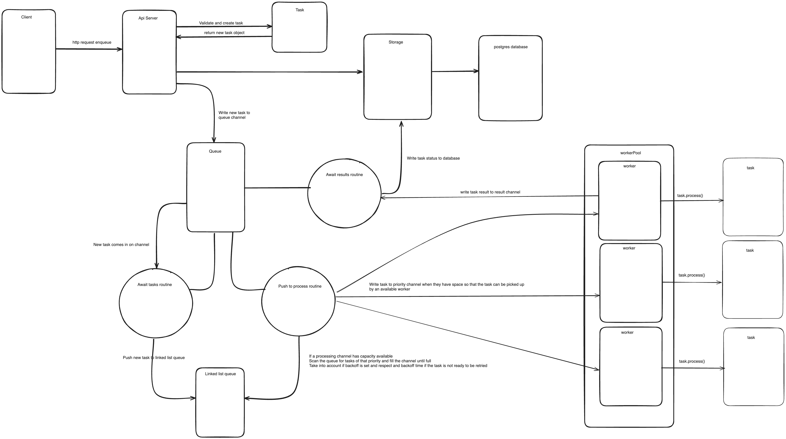

# AsyncTaskProcessor

### Overview
An asynchronous task processing system that should be easily extendable to accommodate new type of tasks. <br/>
The system utilises a priority based queue system with backoff, retries and persistence for task information.

### Running
Docker:
```
docker-compose up -d
```
Go locally (requires go installed):
```
make db
make up
```

### Architecture Diagram for enqueue



### Design Considerations
Context:
Goroutines are utilised to allow for async processing of multiple workers as well as scanning of channels for new work / results. <br/>
Golang channels are a way of goroutines to communicate between each other, the limitation being that in case of the worker pool
we need a buffered channel ( channel of set size ) as this means the channels will keep data on it until it is picked up by a worker.


##### API
- API will take in our requests and route them to the correct handler with some validation, parsing and error returns

##### Queue
- Queue is created at startup and maintains a channel which can be written to with new tasks to be processed
- The Queue is backed by a linked list due to buffer channel limitations, it also help us being able to dynamically scan for next <br/>
tasks to be processed while considering backoff times. Linked list will not maintain the order but allows us to easily pop tasks out of the queue <br/>
when we find one that is ready to be processed. I believe this was the best middle solution as a queue implementation<br/> 
- The queue has routines running for : awaitTasks, awaitResults and pushToProcess
##### Task
- The task package provides a task object as well as holding the Processable interface which means we can
easily implement new types of tasks
##### WorkerPool
- WorkerPool maintains a list of workers which listen for incoming Tasks on the channels and process them based on priority <br/>
This could be improved with more time by adding more dynamic priority / task chans that could be adjusted based on needs and to avoid  <br/>
resources starvation on Lower priority tasks by making sure they get some CPU time every once in a while
- The workers write success / error result to result channel for the queue to decide on how to proceed furter ( backoff / failure / success)
##### Storage
- Storage is a simple wrapper for a postgres database with create, update and get by ID functions <br/>

Storage Schema:
- errors are stored as nullable strings to make it easier to parse back  <br/>
- Payload is stored as json so that we could easily unwrap the task data and re-run failing ones  <br/>
```
        id varchar(100) primary key,
	priority int,
    	taskType varchar(30),
    	status varchar(60),
    	backOffDuration bigint,
    	payload jsonb,      
        createdAt timestamp,
        createdBy varchar(30),
    	startedAt  timestamp,
    	finishedAt  timestamp,
    	error varchar(100)
```


####  Possible improvement areas:
- Every task status is written to database to have an up to date status but perhaps it could be improved on <br/> and only write a subset since some tasks can be very fast causing a high load on the database for no reason
- Cleanup of logging and string formatting, I have used slog since it is a new core library that was added but I should have stuck with zerolog for better readability
- Add better shutdowns through context
- Improve documentation
- Improve endpoint comments and add swagger

### Configurations
```
api:
  listenAddr: ':8080'
queue:
  maxBufferSize: 10 
  workerPoolSize: 5
  maxTaskRetry: 3 
storage:
  host: 'db'
  user: 'postgres'
  dbname: 'postgres'
  password: 'asyncProcessor'
```

Outside of the api address and storage info we can configure the queue to our expectations
```
# sets the max size of the buffer channels which means how many tasks can wait in a channel to be processed
# tasks outside of the buffer will still be tracked in the queue this is to control the channel size 
maxBufferSize: 10
```
```
workerPoolSize: 5 # amount of workers processing tasks
```

```
maxTaskRetry: 3 # max retry on tasks when they fail
```


### API Specification:

Sample task body:
```
      "taskType" : "CPUProcess",
      "priority" : 1, // Optional
      "payload" : {
        "ProcessType" : "want to fail"
      },
      "backOffDuration" : "5s" // Optional
```
All of the requests and postman collection can be found in api/requests to easily import and test. <br/>
### Endpoints:
#### GET /healthz - endpoint to check if service is up and running
```
curl --location 'http://localhost:8080/healthz'
```

#### GET /task/{id} - retrieves task and its status
```
curl --location 'http://localhost:8080/task/{taskId}'
```

#### POST /tasks/enqueue - enqueues tasks 
There are currently 3 task types with taskType CPUProcess being implemented to fail on purpose to allow for testing
```
curl --location 'http://localhost:8080/tasks/enqueue' \
--header 'Content-Type: application/json' \
--data-raw '{
  "tasks" : [
    {
      "taskType" : "SendEmail",
      "payload": {
        "sendTo" : ["helloworld@test.com", "helloWorld2@test.com"],
        "sendFrom": "hello1@test.com",
        "subject" : "Hi !",
        "body" : "hope you are well"
      }
    },
    {
      "taskType" : "GenerateReport",
      "priority" : 1,
      "payload" : {
        "notify" : ["helloworld@test.com", "helloWorld2@test.com"],
        "reportType" : "Financial Report"
      }
    },
    {
      "taskType" : "CPUProcess",
      "priority" : 1,
      "payload" : {
        "ProcessType" : "want to fail"
      },
      "backOffDuration" : "5s"
    }
  ]
}'
```

#### POST /task/{taskId}/retry - allows for a task to be retried
```
curl --location --request POST 'http://localhost:8080/task/e83a5116-0191-462c-8cf7-18c21a3a4939/retry' \
--data ''
```


### Further work to consider:
- [ ] Update config file to match dockerfile and be read from one place 
- [ ] Tests
- [ ] Queue Management - Being able to prioritise queues dynamically and add more queues when needed
- [ ] Queue prioritisation (avoid starvation for low priority tasks by making sure they are executed from time to time)
- [ ] Batch task creation for DB
- [ ] Improve architecture diagram
- [ ] Add swagger spec generation

## TODO
- [x] Config
- [x] API
- [x] Endpoint for enqueue tasks
- [x] Endpoint for querying tasks
- [x] Retry failed endpoint
- [x] Generic Task
- [ ] Queue Management
- [ ] Queue prioritisation (avoid starvation)
- [x] Storage database
- [x] Add docker-compose db to create persistence through sql
- [x] Async Processing
- [x] Error handling, retries
- [x] Dead Letter Queue
- [x] Logging 
- [ ] Tests
- [x] Code Documentation
- [x] System Documentation

Bonus
- [x] Max concurrent limit
- [x] Retries with backoff
- [x] Persistence


Final
- [x] Lint and format imports
 